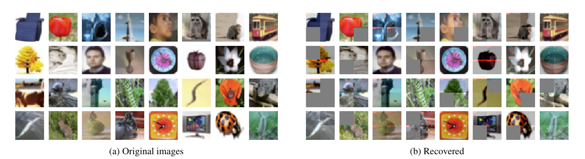

# Gradient Inversion Attacks on Parameter-Efficient Fine-Tuning

This repository contains the code associated with the attack propsed in the paper.

## How to Run
1. Run the file Adapter_attack.ipynb. That will call functions from the following files.
2. Transformer_Model_neuron.py contains the architecture with inserted adapter module
3. Design_Model_Adapter.py contains the code for malicious design of the parameters
4. Processing_v2.py contains the code for creating patch statistics' intervals according to public dataset
5. Recover_Adapter.py recovers the patches from adapter gradients
6. Clustering.py groups the recovered patches to create the entire images (motivated by Fowl et. al., 2023)
7. The folder "Optimization Attack" contains code for optimization-based attack (Geiping et. al., 2020)
